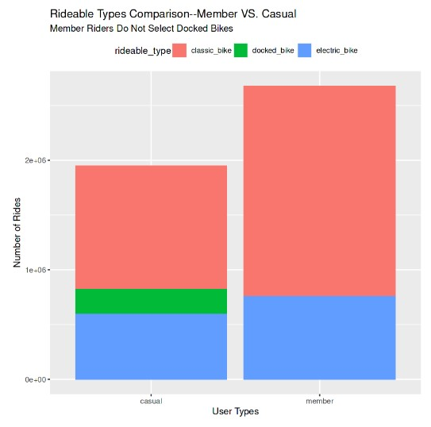
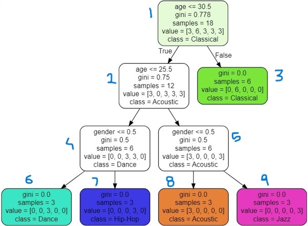

# Rajas_Portfolio
Example data analytics portfolio

# [Project 1: Google Data Analytics Course Capstone Project: Case study 1, Cyclist Bike Share](https://www.kaggle.com/code/rajasprasad/cyclistic-new)
I've been working on the Google Data Analytics Professional Certificate through Coursera. This has been a very insightful course that has included Tableau, R programming, SQL and key data analyst terminologies and processes. Below is my walkthrough of Case Study 1 within the course using various tools and methods.
* The project is a part of Google Data Analytics Certification course capstone.
* The scenario involves analysis of the trip data of Cyclistic bike share company.
* Working as a junior data analyst in the marketing analyst team at Cyclistic, The director of marketing believes the company’s future success depends on maximizing the number of annual memberships.
* The company provides two pricing plans: single-ride passes, full-day passes called as "casual" riders and annual memberships as "Cyclist" members.
* The company operates in Chicago with around 6000 bicycles at 700 stations.
* Maximizing the number of Cyclist members will be key to future growth as it ensures financial sustainability and customer retention.

# [Project 2: Demonstration of music recommendation based on age and gender using decision tree classification](https://github.com/Rvp127/Music_Recommendation-DT-)
Imagine we have an online music store, when our users sign up we ask their age, gender and profile details. Based on their details we recommend various msic albums that they are likely to buy. So in this project we build a machine learning model to increase sales. We feed sample data to the model based on exisiting users. Our model will learn patterns form our data to ask and make predictions when a new user signs up. So we tell our model we have a new user with this profile, what is the kind of music that this user is interested, and our model will suggest the genre like jazz, hip-hop, etc. Based on this we can make suggestions to the user.

# [Project 3: Identification of Lymphocyte WBC from blood smear images](https://github.com/Rvp127/Identification_of_lymphocyte_WBC_in_Blood)
Blood contains Red blood cells (RBC) and White blood cells (WBC). WBC are more darker and bigger in size. There are five types of WBC :  Neutrophils, Monocytes, Eosinophils, Lymphocytes, Basophils. Here the Lymphocytes are darker and circular in shape compared to other types. From blood smear microscopic image we identify the WBC cells and in those mark the Lymphocytes (which are closer to circular in shape).

