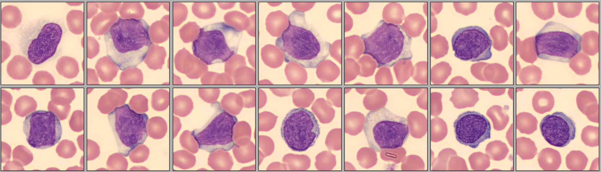

# Rajas_Portfolio
Example data analytics portfolio

# [Project 1: Google Data Analytics Course Capstone Project: Case study 1, Cyclist Bike Share](https://www.kaggle.com/code/rajasprasad/cyclistic-new)
I've been working on the Google Data Analytics Professional Certificate through Coursera. This has been a very insightful course that has included Tableau, R programming, SQL, and key data analyst terminologies and processes. Below is my walkthrough of Case Study 1 within the course using various tools and methods.
* The scenario involves analysis of the trip data of the Cyclistic bike share company.
* The company operates in Chicago with around 6000 bicycles at 700 stations.
* Working as a junior data analyst in the marketing analyst team at Cyclistic, The director of marketing believes the company’s future success depends on maximizing the number of annual memberships. This will be key to future growth as it ensures financial sustainability and customer retention.

## Briefing the Analysis Process

* **Ask**: The company deals in promoting bike-sharing price details to members. 2 types of members are offered by this company **“Casual”(Single rides)** & **“Cyclist”(Annual rides)**. 
So we now ask the right questions
1. What are the differences in bike usage among “Casual” & “Cyclist”?
2. How to encourage “Casual” users to become “Cyclist’ users?

* **Prepare**: Here the company requires a better understanding of the data they are working on (Public or Private). More information regarding the details of the dataset are considered like **start & end stations, ride times, member/casual riders** and **station latitude** and **longitude**.

* **Process**: From the relevant information gained we process and create a new dataset having **trimmed** some columns from the original dataset. Here we perform the **data-cleaning**.

* **Analyze**: We now perform **data-visualization** by plotting trend patterns of bike share demands that include: **Aggregate ride trips into groups, Monthly overview, Member analysis, Popular start and end stations, Periodic trend analysis, Bike type analysis** & **Geographic trend analysis**.

* **Share**: Here we summarize the Potential Customer needs and make Conclusions for all discovered trends. Then we contribute **insights** for representing our **key findings**.

* **Act**: This final phase will determine the progress in the **marketing campaign** for targeting measures to convert **single ride members** to become **annual ride members**.

# [Project 2: Demonstration of music recommendation based on age and gender using decision tree classification](https://github.com/Rvp127/Music_Recommendation-DT-)
Imagine we have an online music store, when our users sign up we ask their age, gender, and profile details. Based on their details we recommend various music albums that they are likely to buy. So in this project, we build a machine-learning model to increase sales. We feed sample data to the model based on existing users. Our model will learn patterns from our data to ask and make predictions when a new user signs up. So we tell our model we have a new user with this profile, what is the kind of music that this user is interested in, and our model will suggest a genre like jazz, hip-hop, etc. Based on this we can make suggestions to the user.

# [Project 3: Identification of Lymphocyte WBC from blood smear images](https://github.com/Rvp127/Identification_of_lymphocyte_WBC_in_Blood)
Blood contains Red blood cells (RBC) and White blood cells (WBC). WBCs are darker and bigger. There are five types of WBC:  Neutrophils, Monocytes, Eosinophils, Lymphocytes, and Basophils. Here the Lymphocytes are darker and circular compared to other types. From the blood smear microscopic image, we identify the WBC cells and in those mark the Lymphocytes (which are closer to circular in shape).

# [Project 4: Health-Care Chatbot Using AI](https://github.com/Rvp127/Healthcare_chat-bot-using-neural-network)
* Health-Care Chatbots are simulators that can understand human language, process it, and interact back to the user while performing specific tasks.
* Majority of hospitals, nursing homes, and even private centers, presently utilize online Chatbots for human services on their sites.
* The chatbot I'm building is interactive to the user by answering questions from a user who can diagnose and provide basic details about the disease before consulting the doctor.

# Project 5: NBA stats Analysis

[Code for web scraping](https://colab.research.google.com/drive/1rYysZsmr2u371yWDzcIOAVCt8PzioLEb?usp=sharing)

* Covers how to web scrape data from website URL
* Stats dataset was scrapped to python kernel i.e.; Colab notebook
* Currently the dataset was available for the 2013-14 season, later manipulated from the 2013-14 season to the 2022-13 season
* The 10-year dataset contained for both the Regular & Playoffs season

[Code for analysis](https://colab.research.google.com/drive/1njgTQecqUSrzVQkNkkQQkaOsfiknD50B?usp=sharing)

* Provided correlation of NBA stats to understand the game metrics
* Analysed how minutes played affected players in the Regular and Playoffs season
* Analysed the shift in the game for a 10-year period that included NBA stats along with Regular and Playoffs season

